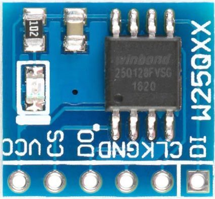
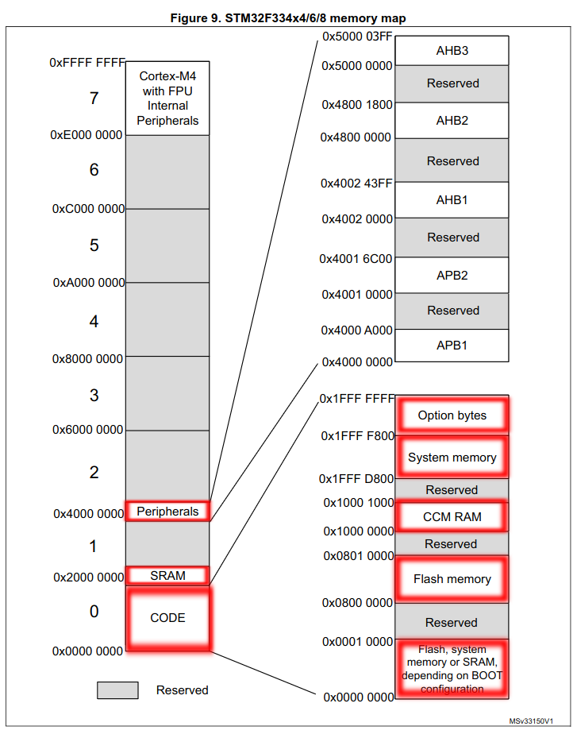
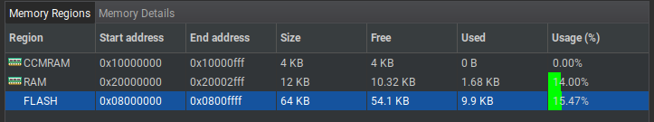
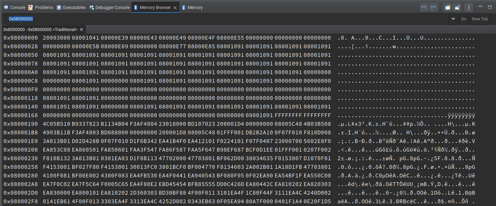
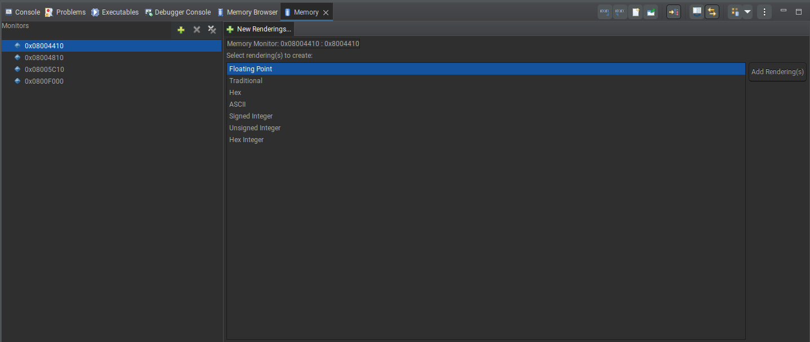
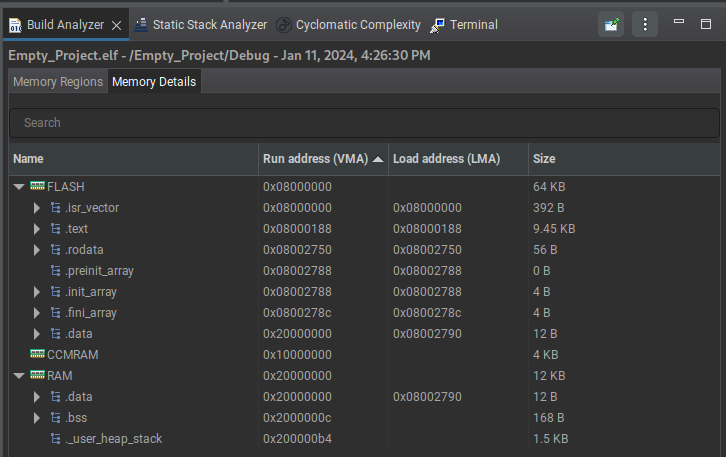

# Читання та запис внутрішньої пам'яті Flash у STM32

 Вітаю, всіх. Я більше року веду курси по вивченню мікроконтролерів AVR, ESP8266 та STM32. Самі курси розраховані на навчання роботі із зовнішньою периферією. Акцент на роботі з внутрішнім пристроєм МКР майже не робиться. Однак я вирішив задуматись а може спробувати ознайомитись з пам'яттю самого МКР. 
 
---
### Власна історія
З самою пам'яттю Flash я познайомився на прикладі модуля `Flash W25QXX`.

 Даний чіп дуже часто використовують для зберігання программи BIOS у материнських платах. Навіть для цього є спеціальні утиліти та программатор. Однак це не віднситься до цієї теми. Суть в тому, що такі модулі ідеально підходять для вивчення пам'яті Flash, яка структура в неї, тощо.

---
### Відомості про Flash

---
### Про Flash в STM32
Тепер повернемось до внутрішньої памятті Flash у МКР. Далі я буду говорити тільки про STM32, а приклад буде для мікроконтролера `stm32f334r8t6`, у якого розмір пам'яті Flash - 64KB.

Почнемо зі складу пам'яті. У пам'яті Flash зберігаються дані та інструкції алгоритму який вшитий у мікроконтролер. Для цього звернемось до даташиту МКР, який був обраний.

Це повна карта стеку всієї пам'яті МКР. Як ми бачимо в пам'яті знаходяться зарезервовано. Але це нас не хвилює нам важливо як з нам звернутись та записати інформацію у пам'ять. Для додаткового ознайомлення я виділ блоки пам'яті які варті вашої уваги.

І так дані про стек Flash пам'яті знаходяться в діапазоні адрес від `0x0800 0000` до `0x0800 FFFF` включно. В STM32CubeIDE навіть можна побачити, які регіони для якої пам'яті.

На даному скріншоті показано скільки займає порожній проект з дефолтними налаштуванням периферій у платі `NUCLEO-F334R8`: `UART`, `GPIO`, `RCC` за допомоги `HAL_Library`. Як було сказано інструкції алгоритму зберігають у Flash. Тому щоб знати в яку область даних можна записувати дані. Щоб дізнатись про це без додаткових алгоритмів виведення в `Serial Monitor`, можна зробити у режимі `Debug` в `CubeIDE`. 

Для цього є вікно `Memory Browser`:

В ньому можемо розглянути всю область Stack'у МКР

Або налаштувати огляд на певні адреси для моніторингу у вікні `Memory`:

На кожну адресу можна налаштувати моніторинг в тому вигляді, який потрібен для відслідковування. Даний спосіб цікавий тим, що в `Memory Browser` лише стандартний вигляд відображення інформації. А у вікні `Memory` можна налаштувати відображення `Page` в залежності від того що має записувати алгоритм програми.

Особисто рекомендую робити моніторинг інформації про Flash вже після ініціалізації біблітоеки та периферії. Також не буде зайвим звернути увагу, які області пам'яті займають інструкції. Оглянути це можна тут:

Тут показано з якого `біта` займає і скільки в `байтах`. І що саме займає регіони пам'яті.

---